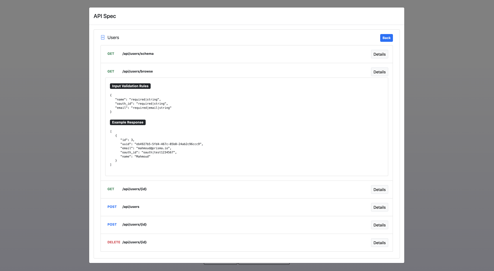

## PlatformKit API

Automatically generate a self-documenting **GraphQL** /  **REST API** from any database.

Built with [Express](https://expressjs.com), [Apollo](https://www.apollographql.com), [Prisma](https://www.prisma.io), and [TypeScript](https://www.typescriptlang.org/).

### 1-Click Deployment

<a href="https://heroku.com/deploy?template=https://github.com/platform-kit/platformkit-api" target="_blank"></a> <a href="https://render.com/deploy?repo=https://github.com/platform-kit/platformkit-api" target="_blank"></a> <a href="https://cloud.digitalocean.com/apps/new?repo=https://github.com/platform-kit/platformkit-api/tree/main" target="_blank"></a>

### Screenshot



## Quick Start
### 1. Clone the repo

```
git clone https://github.com/platform-kit/api platformkit-api
```

### 2. Install npm dependencies:

```
cd platformkit-api
npm install
```
## Documentation
- [Configuration](/docs/1-configuration.md)
- [Development](/docs/2-development.md)